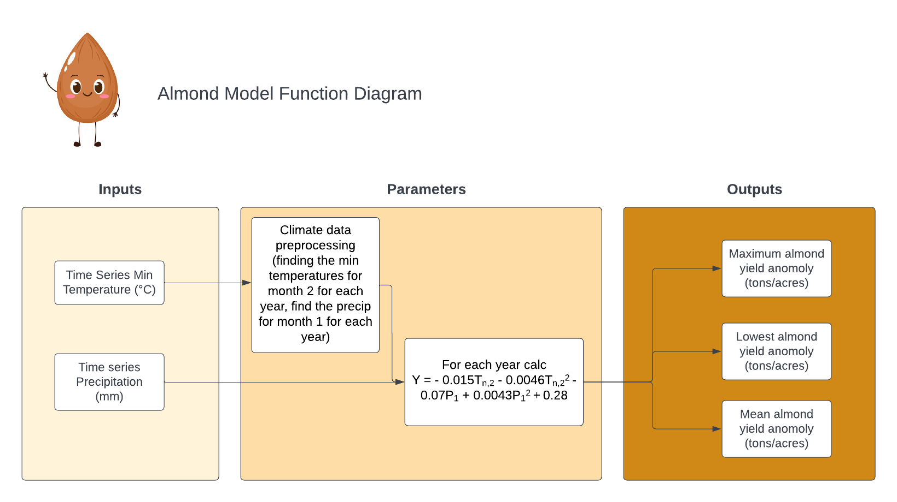

```{r setup, include=FALSE}
knitr::opts_chunk$set(echo = TRUE)

library(tidyverse)
```

## Conceptual Model



## Application of Function
```{r}
source("almond_model.R")

almond_model("clim.txt")
```


## Creating Function Variables/Exploration
```{r}
#read in climate data
clim_df <- read.table("clim.txt", header = TRUE)
```

### Pre-processing data
```{r}
#Tn2: temp min for each year for February
yearly_tmin_feb <- clim_df |>
  group_by(year, month) |>
  summarize(min_temp_2 = min(tmin_c)) |>
  filter(month == 2) |>
  select(-month)

tlist<- as.list(yearly_tmin_feb)

#P1: precip sum for each year for January
yearly_precip_jan <- clim_df |>
  group_by(year, month) |>
  summarize(precip_sum_1 = sum(precip)) |>
  filter(month == 1) |>
  select(-month)

plist <- as.list(yearly_precip_jan)

tmin_precip_df <- left_join(yearly_tmin_feb, yearly_precip_jan)
```

### For Loop
```{r}
#for loop
anomaly_list <- list()

for (year in 1:nrow(tmin_precip_df)) {
  
  # calculate anomaly value for each year and append it to the list
  anomaly_value <- -0.015 * tmin_precip_df$min_temp_2[year] - 0.0046 * (tmin_precip_df$min_temp_2[year]**2) - 0.07 * tmin_precip_df$precip_sum_1[year] +0.0043 * (tmin_precip_df$precip_sum_1[year]**2) + 0.28
  
  anomaly_list[[year]] <- anomaly_value
  
} 

anomaly_vect <- unlist(anomaly_list)
```

### Results
```{r}
#minimum value in the vect
min_val <- min(anomaly_vect)

#maximum value in the vect
max_val <- max(anomaly_vect)

#mean value in the vect
mean_val <- mean(anomaly_vect)
```


