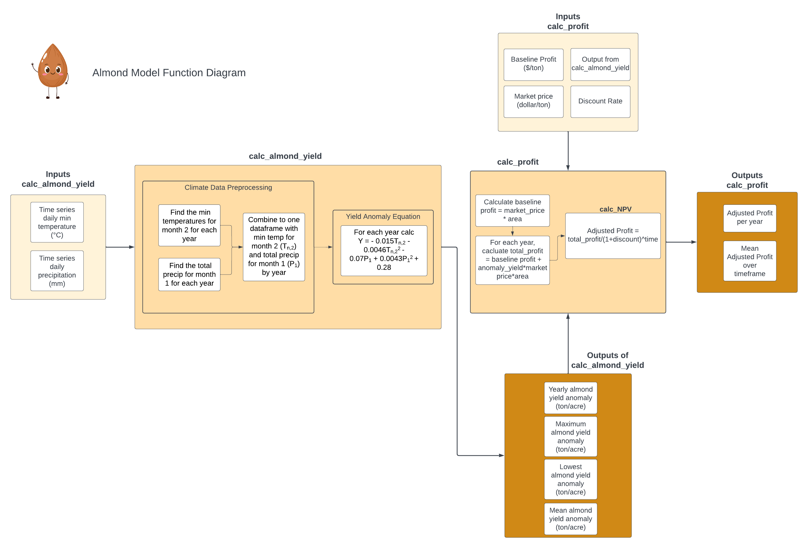

```{r setup, include=FALSE}
knitr::opts_chunk$set(echo = TRUE)

library(tidyverse)
library(purrr)
library(ggpubr)
```

## Conceptual Model including profit



# Application of Function
```{r}
# source all the functions 
source("calc_almond_yield.R")
source("calc_profit.R")
source("calc_NPV.R")

# store the output from the calc_almond_yield function as yield
yield <- calc_almond_yield("clim.txt")

# pass through output from calc_almond_yield to the calc_profit function 
# store the output of the calc_profit funcation as profit
profit <- calc_profit(calc_almond_yield_results = yield)
```

# Informal Sensitivity Analysis
```{r}
# generate samples for both parameters
nsamples = 300
deviation = 0.15
base_price = 5000

# create 300 values for market price with random uniform distribution
market_price = runif(min=base_price-deviation*base_price,
                max = base_price+deviation*base_price, n=nsamples)

# create 300 values for discount rate with a normal distribution
discount = rnorm(mean=0.12, sd = 0.05, n=nsamples)

# store both in a parms dataframe
parms = cbind.data.frame(discount, market_price)

# takes function name and then names of all parameters that don't change
results = parms %>% pmap(calc_profit, calc_almond_yield_results = yield)

# extract mean profit value from the results list created above
mean_adjusted_profit = map_df(results,`[`, c("mean")) 

# add the parameter values for each run
mean_adjusted_profit = cbind.data.frame(mean_adjusted_profit, parms)

# plot 
p1 = ggplot(mean_adjusted_profit, aes(x = market_price, y = mean, col=discount)) +
  scale_color_gradient(low = "darkorchid4", high = "plum1") +
  geom_point(cex=2) +
  labs(y="Mean Annual Adjusted Profit ($)", 
       x="Market Price ($/ton)",
       title = "Profit Model Sensitivity to Market Price") +
  theme_minimal() +
  theme(plot.title = element_text(size = 10))

p2 = ggplot(mean_adjusted_profit, aes(x = discount, y = mean, col=market_price)) +
  scale_color_gradient(low = "darkorchid4", high = "plum1") +
  geom_point(cex=2) +
  labs(y="Mean Annual Adjusted Profit ($)", 
       x="Discount",
       title = "Profit Model Sensitivity to Discount") +
  theme_minimal() +
  theme(plot.title = element_text(size = 10))

ggarrange(p1,p2)
```

**When examining the sensitivity of the profit model to market price and discount rate, there is a stronger correlation between discount rate and profit when compared to market price and profit. This could mean that the model is more sensitive to discount rate than market price.**


